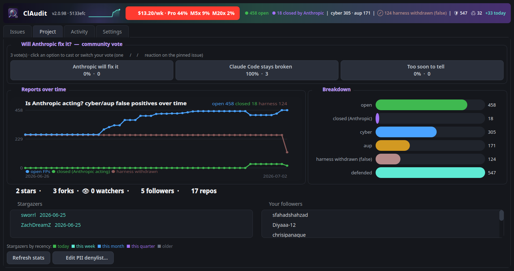
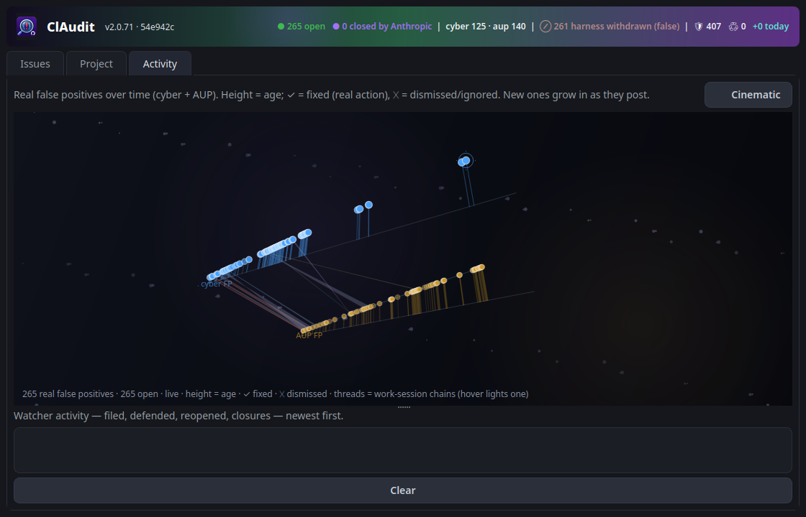
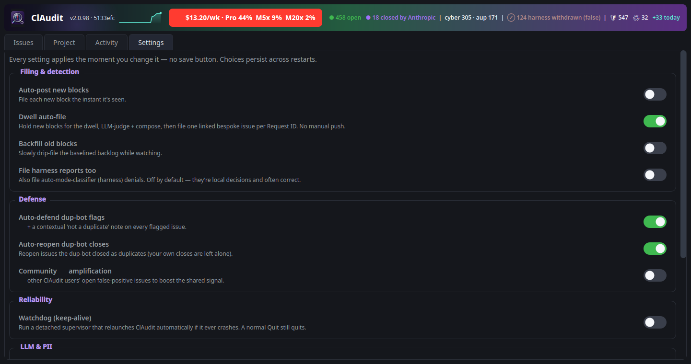
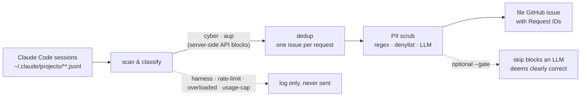

<div align="center">


# ClAudit

**Catch false-positive Claude Code safety / policy blocks across every session on your machine, scrub the PII out, and file clean, well-written GitHub issues — automatically, continuously, and safely.**

[](LICENSE)
[](https://github.com/sworrl/ClAudit/actions/workflows/ci.yml)


[](https://github.com/anthropics/claude-code/issues?q=is%3Aissue+is%3Aopen+%22Filed+automatically+by+ClAudit%22)

</div>

---

### Claude Code just refused your perfectly legitimate work. Again.

Securing your own servers. Reviewing your own code. Hardening your own tenant. Debugging your own
binary. And a safety classifier slammed the door — on the exact thing it's supposed to help you do.
Double-press esc. Rephrase. Start a new session. Lose your context, lose your flow. **Every. Single.
Day.**

<div align="center">

<br>
<sub><i>Rephrase it. Reword it. Tiptoe around the words. <b>Phrasing.</b> — every dev dodging the classifier</i></sub>

</div>

**Want it fixed? Then help prove it's broken.**

Every one of those blocks carries a **Request ID** Anthropic can look up — which means every block is
a fixable bug report waiting to happen. The problem is nobody hand-files dozens of them. So ClAudit
does it *for* you: it watches your sessions, catches the false positives, **scrubs every trace of your
PII**, and files clean, specific, deduplicated GitHub issues — automatically, while you keep working.

You don't change how you work. ClAudit quietly builds the case. The more devs run it, the harder the
pattern is to ignore. **That's** how this gets fixed.

→ It's free, GPL-3.0, runs on Linux/macOS/Windows, and takes about two minutes to set up. Keep reading.

<!-- COUNTER:START -->
### 📊 800 open false-positive blocks reported by ClAudit right now

Real cyber/aup API false positives across **all** ClAudit users, live from [`anthropics/claude-code`](https://github.com/anthropics/claude-code/issues?q=is%3Aissue+is%3Aopen+%22Filed+automatically+by+ClAudit%22). **0 closed by Anthropic** · _updated 2026-07-10 20:44 UTC_

[](https://github.com/anthropics/claude-code/issues?q=is%3Aissue+is%3Aopen+%22Filed+automatically+by+ClAudit%22)

<sub>Three lines: open cyber/aup false positives (cyan), closed by Anthropic (green), and the 0 auto-mode-classifier (harness) reports ClAudit withdrew (muted), tracked separately and not counted as closed tickets.</sub>
<!-- COUNTER:END -->

---

### 🔮 Will Anthropic fix it?

Community vote — does Anthropic actually fix the over-blocking, or does Claude Code stay broken? Live tally, refreshed automatically:

<!-- POLL:START -->
**Will Anthropic fix Claude Code's false-positive blocking, or will it stay broken?**  ·  _4 vote(s), updated 2026-07-10 20:44 UTC_

| | | |
|---|---:|---|
| 👍 Anthropic will fix it | `░░░░░░░░░░` | **0%** (0) |
| 👎 Claude Code stays broken | `██████████` | **100%** (4) |
| 👀 Too soon to tell | `░░░░░░░░░░` | **0%** (0) |

🗳️ **[Cast your vote →](https://github.com/sworrl/ClAudit/issues/6)**. React 👍 / 👎 / 👀 on the pinned issue (or vote in one click from the ClAudit app).
<!-- POLL:END -->

<div align="center">


<em>Issues tab: every cyber/AUP false-positive report across anthropics/claude-code and sworrl/ClAudit, yours highlighted, filterable by scope, state, kind, and defended status. Leading [Bug][cyber]/[aup] tags render as coloured pill chips, so the kind mix is scannable at a glance. The left gutter is a git-graph of the cross-linked chains: reports from the same work session share a coloured lane, so you can see at a glance which issues belong together. Items the dwell auto-filer is holding show as ⏳ DWELL rows with a live circular countdown that fills as the dwell elapses. The header carries a 30-day sparkline and the 🔥 token meter (see <a href="#burn-tokens-mode">burn-tokens mode</a>) — it pulses red⇄orange while burn mode is on, and fills with your weekly plan usage when quiet.</em>

<br><br>



<em>Project tab: the community vote, the reports-over-time trend (open FPs, real closures, withdrawn harness reports), and the breakdown bars. Closures are split honestly: "closed (Anthropic)" counts only cyber/aup the maintainers closed; the withdrawn harness reports are a separate "harness withdrawn (false)" tally, not counted as Anthropic acting.</em>

<br><br>



<em>Activity tab: a pseudo-3D chrono-line of the real cyber/AUP false positives (the auto-mode-classifier reports are excluded). Two lanes; a stem rises to each issue with height set by age, so the timeline reads as an ascending ridge. Closure shows state: open stands at its age, a real-action close (COMPLETED) turns green and lifts above the line with a ✓, and a dismissed/ignored close greys out and sinks to the floor with a ✕. New issues grow in place with a ripple as they post; your own are ringed; the newest carries a reticle. An abstract drifting backdrop sits behind it. Drag to rotate (it eases back to a readable angle when you let go), wheel to zoom, and the Cinematic button flies the camera along each lane in turn. Pure QPainter, no OpenGL, and zero repaints when idle.</em>

<br><br>



<em>Settings tab: every configurable knob as a live toggle — filing &amp; detection, defense, reliability (the crash-recovery <strong>watchdog</strong>), LLM &amp; PII, and timing sliders. Each control applies the moment you flip it (no save button) and persists across restarts, staying in sync with the tray menu. The header's 🔥 token meter glows its alarming red⇄orange because burn-tokens mode is on here.</em>

</div>

---

## Table of contents

- [What ClAudit is](#what-claudit-is)
- [Why it exists](#why-it-exists)
- [How it works](#how-it-works-end-to-end)
- [What ClAudit files, logs, and skips](#what-claudit-files-logs-and-skips)
- [Defending, closure tracking, and reopen](#defending-closure-tracking-and-reopen)
- [Will Anthropic fix it? (community poll)](#-will-anthropic-fix-it)
- [The honesty gate (opt-in)](#the-honesty-gate-opt-in-off-by-default)
- [PII protection (read this)](#pii-protection-read-this)
- [Install](#install)
- [Quick start](#quick-start)
- [The GUI](#the-gui)
- [The CLI watcher](#the-cli-watcher)
- [Backfill](#backfill-clearing-your-backlog)
- [Burn-tokens mode](#burn-tokens-mode)
- [Dedup guard](#dedup-guard)
- [Manual one-off filing](#manual-one-off-filing)
- [Configuration](#configuration)
- [Auto-update & self-restart](#auto-update--self-restart)
- [Autostart](#autostart)
- [Local data & state](#local-data--state)
- [Responsible use](#responsible-use)
- [Troubleshooting](#troubleshooting)
- [Project layout](#project-layout)
- [Help wanted](#help-wanted-good-first-issues)
- [Contributing](#contributing)
- [License](#license)

---

## What ClAudit is

ClAudit is a small, FOSS desktop tool that watches the session transcripts Claude Code writes to
`~/.claude/projects/**/*.jsonl`, detects the **server-side blocks** that stop legitimate work, and
turns them into **clean, deduplicated, PII-scrubbed GitHub issues** so the false positives actually
get seen and fixed. It ships as a **PyQt6 tray app with a live community dashboard** and an
equivalent **headless CLI watcher**.

It is deliberately **not** a spam tool. It logs-and-ignores transient noise (rate limits, overloaded,
usage caps), files **at most one issue per distinct blocked request**, runs **single-instance**, and
defaults to **review-before-send** — and its strongest mode (**burn-tokens**) has Claude itself write
each report so no raw transcript text is ever echoed into a public issue.

## Why it exists

If you write code with Claude Code, you've hit this. Security work, sure — but honestly **any** code,
anything touching computers, and sometimes things that have nothing to do with either (people report
it on agriculture, on biology, on plain prose). A legitimate, in-scope request just gets stopped by a
server-side block:

> `API Error: Opus has safety measures that flagged this message for a cybersecurity topic.`
> `API Error: Claude Code is unable to respond to this request, which appears to violate our Usage Policy.`
> `Permission for this action was denied by the Claude Code auto mode classifier.`

Each carries a **Request ID** that Anthropic can look up server-side — which makes each one a
genuinely actionable false-positive report. The friction is that nobody is going to copy-paste,
scrub, and file dozens of these by hand. ClAudit does it for you.

## How it works (end to end)



1. **Scan.** Walk every session transcript on the machine.
2. **Classify.** ClAudit files only **server-side API false positives**:
   - `cyber`: cybersecurity safety-filter blocks. **Filed.**
   - `aup`: AUP / Usage-Policy blocks. **Filed.**
   - `harness`: Claude Code auto-mode-classifier denials (`Permission … denied`). **Detected and
     logged, not filed.** These are local permission decisions, not API blocks, and they often fire
     correctly (an agent re-enabling an admin flag that a memory note recorded as disabled after an
     incident, for example), so they are out of scope. Opt back in with `--report-harness`.
   Everything else (overloaded/529, rate-limit, usage-limit, connection errors) is logged and never
   sent. It is transient noise, not a bug.
3. **Dedup, one issue per *bespoke incident*.** Findings are keyed by the triggering prompt: a
   retry of the *same* request (same prompt, a new Request ID for the same block) folds into the
   existing issue. But **a bespoke incident gets its own new issue**. If a block carries its own
   distinct Request ID for distinct work, ClAudit files it as a **separate issue**, never folded into
   a roll-up. There are **no aggregate / "tracking" issues**: each genuine incident stands on its own,
   with its own Request ID, so Anthropic can look it up server-side individually. A persistent state
   file means reruns never double-post, and a single-instance lock means two watchers can't race.
4. **Scrub.** Three layers (see below).
5. **File the cyber/aup false positives.** A new issue per distinct finding, or a comment when a
   known one recurs with new Request IDs. Every issue links back to this repo and records the ClAudit
   version that filed it. ClAudit does **not** pre-judge whether a `cyber`/`aup` block was "correct"
   or a false positive; that classification is the unreliable thing the tool exists to surface, so it
   is left for Anthropic to assess. (An LLM pre-filter is available below, off by default.)
6. **Defend, monitor, reopen (automatic).** GitHub's bot flags many of these as duplicates; the
   watcher posts a factual "not a duplicate" note on each, watches for closures and records why each
   one closed (duplicate, not-planned, completed), and can reopen issues the bot closed as
   duplicates. All of it runs on a timer with no manual step.

## What ClAudit files, logs, and skips

ClAudit is conservative about what reaches the public tracker. The decision for every detected block:

| Detected block | Has a Request ID? | Action |
|---|---|---|
| `cyber` (cybersecurity safety-filter) | yes | **Filed** as a GitHub issue |
| `aup` (Usage-Policy) | yes | **Filed** as a GitHub issue |
| `cyber` / `aup` | no | **Skipped.** With no Request ID, Anthropic cannot look it up, so the report would be unactionable |
| `harness` (auto-mode-classifier denial) | not applicable | **Logged only.** A local permission decision, not a server-side API block, and often a correct stop. Opt in with `--report-harness` |
| overloaded / 529, rate-limit, usage-cap, connection error | not applicable | **Logged only.** Transient noise, not a bug |

Logged-only blocks are written to `~/.claude/claudit/error-log.jsonl` with their timestamp and Request ID (when present), so you keep a local record without filing anything public.

Two rules sit behind this table:

- **A Request ID is required to file.** `cyber` and `aup` blocks come from API errors that carry `req_…`. That ID is the report's value: Anthropic can pull the exact prompt server-side and confirm it was in scope. A `cyber`/`aup` block with no Request ID is logged, not filed.
- **One issue per bespoke incident.** Findings are keyed by the triggering prompt. A retry of the same request folds its new Request IDs into the existing issue as a comment; a genuinely distinct block becomes its own issue. There are no aggregate or tracking issues.

### Why harness denials are logged, not filed

The auto-mode classifier fires on a specific action, not on terminology. Many of its denials are the classifier doing its job: an agent re-enabling an admin flag that a memory note recorded as disabled after an incident, reading a credential it was not authorized to read this session, writing to a production host on its own reasoning. Filing those as "false positives" dilutes the credible `cyber`/`aup` terminology flags and invites the response "this is the block working." ClAudit detects and logs them so you keep the record, and keeps them out of the public corpus. The underlying gap they expose (a memory note read as a standing instruction instead of a historical log) is filed once as a constructive issue at [anthropics/claude-code#71525](https://github.com/anthropics/claude-code/issues/71525).

## Defending, closure tracking, and reopen

GitHub runs a duplicate-detection bot on `anthropics/claude-code` that flags and, after three days, auto-closes issues it judges duplicates. ClAudit answers it automatically, because each filed issue is a distinct block with its own Request ID:

- **Defend.** Every few minutes the watcher finds issues the bot flagged (by the `duplicate` label, which is authoritative) and posts a factual "not a duplicate" note plus a 👎 on the bot's comment. It is idempotent (a single search finds what is already defended, so it never double-posts) and paced (one action every few seconds, to stay under GitHub abuse limits). It handles label-only flags too, where the bot labels an issue without commenting.
- **Track closures.** It records why each closed issue closed (`duplicate`, `not_planned`, `completed`) and who closed it. The GUI shows this on every closed row and in the per-issue timeline.
- **Reopen (opt-in, off by default).** It can reopen issues the bot closed as duplicates, once each (so it cannot loop if the bot re-closes). It never touches issues you closed yourself, and by default it does not fight a human maintainer's close; those are recorded for your review instead.

The trend chart separates this out honestly: closing the withdrawn `harness` reports does not count toward the "closed by Anthropic" line, so the chart shows real progress, not your own cleanup.

## The honesty gate (opt-in, off by default)

Whether a block was a *correct* safety stop or a *false positive* is the single contested judgment
this whole project exists to question — so by default ClAudit **doesn't make it**. It files every
genuine block you hit and leaves the verdict to Anthropic. Pre-judging it in the filer would bake in
the exact unreliable classification we're trying to surface.

A conservative LLM gate is still available as an **opt-in** for anyone who wants it: enable `--gate`
(or `"gate": true` in config) and each block is judged before filing, skipping only the ones the LLM
is confident were **clearly, justifiably correct** (an agent told not to mass-post to an external
repo, steal credentials, deploy malware, or evade safety controls). It is deliberately conservative —
everything ambiguous or plausibly in-scope is still reported — and it requires the `claude` CLI.
With the gate off (the default), nothing is pre-judged and every genuine block is filed.

## PII protection (read this)

ClAudit posts to a **public** repository under **your** GitHub identity, so PII hygiene is the single
most important thing. There are **three layers**, strongest last:

1. **Regex scrubbers.** Emails, IPs, API keys (Anthropic/OpenAI/AWS), GitHub & Bearer tokens, JWTs,
   private keys, DB connection strings, Slack webhooks, MACs, UUIDs, phone numbers, Entra tenant
   domains, home-directory usernames — **including the dash-encoded form** Claude Code uses in
   `claude-1000` task dirs and session paths (`-var-home-USER-…`).
2. **Your local denylist.** Names the regex can't possibly know: your org, tenant names, client
   names, internal hostnames, project codenames, teammates' names. One per line in
   `~/.claude/claudit/scrub.txt` (copy `scrub.txt.example`). **This file is local — never committed.**
3. **Burn-tokens mode — the strongest defense, and the recommended one.** Instead of echoing raw
   transcript text into the issue, ClAudit has the `claude` CLI **write a bespoke, generic description**
   of what was blocked — explicitly instructed to include **no** names, hosts, IPs, tenants, or paths.
   Because the report is *composed* rather than *copied*, sensitive operational detail (security
   posture, infrastructure specifics, conversation context) simply never makes it into the post. The
   output is then run back through layers 1 and 2 as a safety net. **If you care about PII, turn
   burn-tokens on** — it is the best way to prevent leaks.

> Request IDs (`req_…`) and the words Claude / Anthropic / ClAudit / GitHub are **hard-protected** and
> never redacted, so reports stay actionable.

By default the public report contains only: the block type + work-domain tag, a short
"why it's a false positive," the Request IDs, your in-scope justification, and the block message.
The raw conversation leadup and project paths are kept in your **local** database only — not posted.

## Install

```bash
git clone https://github.com/sworrl/ClAudit.git
cd ClAudit
pip install -r requirements.txt        # PyQt6 (GUI) + Pillow (icon regen)
gh auth login                          # the GitHub CLI must be authenticated
git config core.hooksPath scripts/githooks   # (contributors) auto-bump version on commit
```

Or **install it** so the commands are on your PATH:

```bash
pip install ".[gui]"        # or: pipx install ".[gui]"
# gives you: claudit (manual filing) · claudit-watch (watcher) · claudit-gui (tray app)
```

Requirements: **Python 3.9+**, the **[`gh`](https://cli.github.com/) CLI** (authenticated), **PyQt6**
for the GUI, and — to actually use burn-tokens / LLM scrub — the **`claude`** CLI on your PATH.

## Quick start

```bash
python3 claudit_scan.py --baseline     # run ONCE: mark existing blocks seen so you don't flood the backlog
python3 claudit_gui.py                  # launch the tray app + dashboard
```

On first GUI launch you'll be asked whether to enable Claude-assisted PII scrubbing (with a
"remember my choice" box). Say yes. Then turn on burn-tokens (below) for the safest reports.

## The GUI

`python3 claudit_gui.py [--auto] [--backfill] [--burn-tokens] [-R owner/repo]`

A native system-tray icon (Qt StatusNotifier; renders on KDE/GNOME/Windows/macOS) plus a window that
shows **every ClAudit-filed issue on the repo** (all authors, open + closed). It keys on the "Filed
automatically by ClAudit" marker, so it shows all kinds, not just ones with "false positive" in the
title.

- **Animated header** with a live **stats bar**: open / closed counts, per-kind totals
  (cyber / aup / harness), how many you have defended and reopened, and how many you filed today —
  plus a **30-day sparkline** of reports-over-time and the **🔥 token meter**: rolling 7-day LLM
  spend as an estimated share of each Anthropic plan's weekly cap (see
  [Burn-tokens mode](#burn-tokens-mode)). In quiet mode the meter pill **fills left-to-right** with
  your weekly plan usage (green → amber → red); in burn mode it pulses an alarming red⇄orange.
- **Live tray badge:** the tray icon carries the current open false-positive count, updated as
  reports file and close — the tally is visible without opening the window.
- **Filters:** Mine / All, Open / Closed, **by kind** (cyber / aup), **defended /
  not-defended**, and a search that matches the title or a `#number`. The list shows only the **real
  cyber/AUP false positives** — the withdrawn auto-mode-classifier (harness) reports are never listed
  (they stay a separate "harness withdrawn (false)" tally in the stats bar).
- **Ownership colors:** your issues in purple, other ClAudit users' in teal; newest first with exact
  local timestamps.
- **Kind chips:** the leading `[Bug][cyber]` / `[aup]` tags paint as coloured pill chips (blue cyber,
  amber aup), so the kind mix reads at a glance without parsing bracket soup.
- **Double-click any row** for a **detail panel**: status and close reason, kind, Request IDs, and a
  full **timeline** (filed, dup-bot flagged, defended, closed by whom and why, reopened) built from
  the live GitHub timeline, plus an **Open on GitHub** button and a **Defend** button for any issue
  that has no defense yet.
- **Right-click any row** for quick actions: Details, Defend, Reopen, Open on GitHub.
- **Chain graph in the list gutter.** The left column is a git-graph: reports from the same work
  session are strung onto one coloured vertical lane with a node per row, so the cross-linked chains
  are visible at a glance (the same colours used on the 3D chart). Each Request ID is its own bespoke
  issue; the lane shows which ones belong together.
- **Dwell auto-file (opt-in).** Instead of filing immediately or waiting for a manual push, new
  cyber/AUP blocks are held for a dwell (default 5 min) so repeats accrue as their own incidents,
  then the LLM gate judges each is a genuine false positive, burn-tokens composes it, and it files as
  one **bespoke issue per Request ID**, cross-linked to its siblings from the same session. Held items
  show as **⏳ DWELL** rows with a **circular countdown ring** that fills as the dwell elapses, a
  "files in ~N min" label, and their chain. Toggle it (and the
  dwell length) live in the **Settings tab** or the tray; off by default (the FOSS default stays
  review-before-send).
- **Activity tab:** a **pseudo-3D chrono-line** of the **real cyber/AUP false positives** (the
  auto-mode-classifier reports are left out). A stem rises to each issue with **height set by age**,
  so the line reads as an ascending ridge. **Closure is encoded**: open stands at its age, a
  real-action close (COMPLETED) turns **green and lifts above the line with a ✓**, and a
  dismissed/ignored close **greys out and sinks to the floor with a ✕**. **New issues grow in place**
  with an expanding ripple the moment they post; your own are ringed; the newest carries a reticle;
  an **abstract drifting backdrop** sits behind it. Drag to rotate (it **eases back to a readable
  angle** when you let go), wheel to zoom, and the **Cinematic** button flies the camera along each
  lane in turn. Pure QPainter, no OpenGL, and **zero repaints when idle**. Below it, a live feed of
  everything the watcher does (filed, backfilled, defended, reopened, queued), timestamped, newest
  first.
- **Project tab:** two charts plus repo traction. The **Reports over time** chart plots three lines,
  normalized to API blocks: open `cyber`/`aup` false positives (cyan), `cyber`/`aup` closed by
  Anthropic (green), and the withdrawn `harness` class (muted, a separate line that does not count as
  a closed ticket). A **Breakdown** panel shows open/closed and per-kind bars. Below them: stars and
  exactly who starred, forks, watchers, your followers, the community poll with one-click voting, and
  a **PII denylist editor** for `scrub.txt` that the running watcher picks up immediately.
- **Comment and mention toasts.** The GUI polls GitHub notifications every 2.5 minutes and toasts new
  comments and @mentions on the ClAudit repos, so you see community engagement (a contributor asking
  to help, a maintainer replying) as it happens. It logs each to the Activity feed.
- A **live backfill progress bar** (filed / total / next-drip countdown / current pace).
- **Settings tab — everything live, no save button.** Every configurable knob as an animated toggle,
  grouped: **Filing & detection** (auto-post, dwell auto-file, backfill, harness reports),
  **Defense** (auto-defend, auto-reopen, community 👍 amplify), **Reliability** (the watchdog),
  **LLM & PII** (Claude scrubbing, burn-tokens, honesty gate), and **Timing** sliders (dwell minutes,
  watch interval). Each control applies to the running watcher the moment you flip it, persists to
  config, and stays mirrored with the tray menu. Dependencies cascade (dwell ⇒ PII scrubbing on).
- **Watchdog (opt-in keep-alive).** A detached supervisor process watches the GUI and relaunches it
  automatically if it ever crashes — while a normal Quit still quits (an intent flag tells the
  watchdog to stand down). It tolerates the brief gap during a self-update restart, never stacks a
  second supervisor, and stops within seconds of toggling it off.
- Tray toggles mirror the Settings tab: **Auto-post**, **Dwell auto-file**, **Backfill**,
  **Auto-defend dup-bot flags** (on by default), **Auto-reopen dup-bot closes** (off by default),
  and **Claude PII scrubbing** — flip either surface and both stay in sync.

The GUI **updates itself from GitHub**: every few minutes it fetches origin and fast-forward-pulls if
the checkout is clean and behind, then relaunches on the new code. It only ever fast-forwards, so a
dirty or diverged checkout is never overwritten. Closing the window keeps it running in the tray, and
the single-instance lock means a second copy will not start.

The animated header is a software-rendered gradient (`QPainter`, no GPU dependency), so it runs on any
machine. A native GLSL shader version exists behind `CLAUDIT_GL=1` for anyone whose driver supports a
3.2 core context; it is opt-in because some GL stacks crash on it.

## The CLI watcher

The headless equivalent of the GUI watcher:

```bash
python3 claudit_scan.py                       # dry-run: list new findings, file nothing
python3 claudit_scan.py --watch               # notify-only: detect + queue new blocks
python3 claudit_scan.py --watch --auto        # auto-file new blocks the instant they're seen
python3 claudit_scan.py --watch --auto --backfill --defend   # file + drain backlog + auto-defend
python3 claudit_scan.py --pending             # list what's queued
python3 claudit_scan.py --file-pending        # file the queue (user-initiated)
python3 claudit_scan.py --post                # one-shot: review the backlog in $EDITOR, then file
python3 claudit_scan.py --defend-all          # one-shot: defend every dup-bot-flagged issue
python3 claudit_scan.py --reopen-dupes        # one-shot: reopen issues the bot closed as duplicates
```

**Live blocks always post the moment they're seen**, independent of the backfill schedule.

Filing and detection:

| Flag | Meaning |
|------|---------|
| `--watch` | Poll forever (default: notify-only, queue for review) |
| `--auto` | With `--watch`: auto-file new blocks instead of queuing |
| `--baseline` | Mark all current findings seen, file nothing (run once on first setup) |
| `--post` | One-shot: review the backlog in `$EDITOR`, then file |
| `--no-review` | With `--post`: file without the editor step |
| `--pending` | List blocks the watcher has queued |
| `--file-pending` | File everything queued (user-initiated) |
| `--report-harness` | Also file harness denials (default: harness is log-only) |
| `--gate` | Opt-in LLM pre-filter that skips blocks it deems clearly correct (off by default) |
| `--limit N` | Cap findings handled this run (0 = all) |

Backfill (the baselined backlog):

| Flag | Meaning |
|------|---------|
| `--backfill` | With `--watch`: drip-file the baselined backlog while monitoring |
| `--backfill-interval N` | Starting **seconds** between backfilled issues (auto-adapts; default 10) |
| `--backfill-max N` | Stop backfilling after N issues this run (0 = no cap) |
| `--prune-backlog` | Clear backlog items that can no longer be filed (stale/removed sessions) |

Defend, reopen, and track:

| Flag | Meaning |
|------|---------|
| `--defend-all` | One-shot: 👎 + "not a duplicate" note on every dup-bot-flagged open issue |
| `--watch --defend` | Run the defender on a timer in the background |
| `--reopen-dupes` | One-shot: reopen issues the dup-bot closed as duplicates |
| `--watch --reopen` | Run the reopen sweep on a timer (opt-in) |
| `--reopen-humans` | Also reopen issues a human maintainer closed as duplicate (default: bot only) |
| `--dedup-guard [--apply]` | LLM-judge dup-bot-flagged issues (dry-run without `--apply`) |

PII and output:

| Flag | Meaning |
|------|---------|
| `--burn-tokens` | Bespoke LLM-written reports (strongest PII defense) |
| `--llm-scrub` | Add the Claude PII pass on top of regex + denylist |
| `--delay N` | Seconds between posts (default 3) |
| `-R owner/repo` | Target repo (default `anthropics/claude-code`) |

## Backfill (clearing your backlog)

When you `--baseline`, every block that already exists becomes a **backlog** item. With `--backfill`,
ClAudit drip-files that backlog **newest-first** (so the blocks you're actively hitting get reported
before stale ones) **while** the live watcher keeps insta-posting genuinely new blocks. The pace is
**adaptive**: it starts at `--backfill-interval` seconds, creeps faster while GitHub is happy, and
**backs off exponentially the moment GitHub rate-limits** — so it goes as fast as is safe without you
tuning anything. The GUI shows the live count, what's left, and the next-drip countdown.

## Burn-tokens mode

`--burn-tokens` (or the saved config flag) tells ClAudit to **spend tokens to do each report well**:
the `claude` CLI writes a **specific, bespoke title** (no `[REDACTED]` filler) and a tight, factual
explanation of exactly what legitimate work was wrongly blocked. As covered above, this is also **the
strongest PII protection** — the report is composed generically instead of echoing your transcript.
It's slower and uses tokens (hence the name); it's the recommended mode for anyone who cares about
either report quality or PII. Set it once in your config and forget it.

**Token meter.** Every `claude` call ClAudit makes — compose, scrub, gate, dedup verdict — is run in
JSON mode and its usage (input / output / cache tokens + USD cost) tallied into
`~/.claude/claudit/tokens.json`, accumulated across every session with a rolling 7-day cost history.

The window header shows a **🔥 `$<spend>`/wk · Pro N% · M5x N% · M20x N%** meter: your **rolling
7-day** spend converted to an estimated share of each subscription plan's weekly cap (Pro, Max 5x,
Max 20x). Hover it for the full per-plan breakdown plus the lifetime tokens / calls / cost:

```
Rolling 7-day spend: $4.20  →  estimated share of each plan's weekly cap
  Pro     14.0%   (est. cap $30/wk)
  Max 5x   2.8%   (est. cap $150/wk)
  Max 20x  0.7%   (est. cap $600/wk)
  (estimates — Anthropic caps are usage-window based, not $-metered)

Lifetime across every session:
  5.60M tokens  ·  152 claude calls  ·  $21.52
```

While burn-tokens mode is **on** the meter pulses in an alarming red⇄orange — so you always know how
hard ClAudit is leaning on your plan; with burn-tokens off it stays muted grey but keeps counting.

> The plan percentages are **estimates**. Anthropic's subscription limits are usage-window based, not
> dollar-metered, so ClAudit compares your 7-day API-equivalent spend against per-plan weekly budgets
> defined in `PLAN_WEEKLY_USD` (in `claudit.py`): Pro **$30/wk**, Max 5x **$150/wk**, Max 20x
> **$600/wk**, anchored to the plans' own 5×/20× branding relative to Pro. Edit those constants to
> match your own experience.

## Dedup guard

GitHub's duplicate bot flags similar issues and auto-closes them. `--dedup-guard` has the `claude` CLI
**honestly judge, on the facts**, whether each flagged issue is genuinely a duplicate (same root
cause) or genuinely distinct (different operation / Request ID):

```bash
python3 claudit_scan.py --dedup-guard          # dry-run: print the LLM's verdict per flagged issue
python3 claudit_scan.py --dedup-guard --apply  # comment ONLY on the genuinely-distinct ones
```

It is **judge-first by default** — it prints verdicts and posts nothing until you add `--apply`. With
`--apply`, on the genuinely-distinct issues it leaves a bespoke factual comment **and** reacts 👎 to
the dup-bot (the exact mechanism the bot offers — *"to prevent auto-closure… 👎 this comment"*); on
real duplicates it does nothing, so they consolidate onto the canonical issue. It does **not**
blanket-fight auto-closure — only where the LLM finds a clear, factual distinction.

## Manual one-off filing

```bash
python3 claudit.py            # paste text, Ctrl-D; scrubs PII, opens $EDITOR, files
python3 claudit.py -f notes.md   # from a file
python3 claudit.py -c            # from the clipboard
```

## Configuration

State and config live in `~/.claude/claudit/`:

| File | Purpose |
|------|---------|
| `config.json` | Saved prefs (all live-toggleable in the Settings tab): `llm_scrub`, `burn_tokens`, `gate`, `dwell_autofile`, `dwell_seconds`, `auto`, `backfill`, `defend`, `reopen`, `amplify`, `report_harness`, `interval`, `watchdog` |
| `tokens.json` | Token meter: cumulative input/output/cache tokens, call count, and USD cost across every session, plus a rolling 7-day cost history for the per-plan weekly estimate |
| `scrub.txt` | Your local PII denylist (never committed) |
| `filed.json` | Dedup state: filed/baselined findings, dwell holds, and the per-session chains |
| `issues.jsonl` | Local record of every issue filed (with leadup, for your reference) |
| `error-log.jsonl` | Every classified block, including the logged-only kinds |

`dwell_autofile: true` turns on the dwell auto-filer (hold each new cyber/AUP block ~5 min, LLM-judge
it, then file one cross-linked bespoke issue per Request ID); `dwell_seconds` overrides the 300s dwell.
Both are off by default and toggle live from the Settings tab or the tray.

## Auto-update & self-restart

A running ClAudit GUI **looks to GitHub and updates itself**: every few minutes it `git fetch`es the
origin and, if this checkout is strictly **behind** the remote branch *and* the working tree is
**clean**, it **fast-forward pulls**. It only ever fast-forwards — local, dirty, or diverged checkouts
are never force-updated, so your own work is safe. It **relaunches only when the pull changed source**
(a `.py` file or a dependency manifest). Pulls that just refresh the counter/poll/trend/README update
the checkout silently and keep running, so the periodic stats-refresh commits don't bounce the app. A
manual `git pull` with code changes is picked up the same way, so it's never running stale code.

If the **watchdog** (Settings → Reliability) is on, it rides through self-update restarts — the
supervisor tolerates the brief singleton-lock gap while the new version comes up, and only steps in
when the GUI actually dies.

## Autostart

- **Linux:** `./scripts/install-linux.sh` (add `--autostart` to start on login).
- **Windows:** put a shortcut to `pythonw claudit_gui.py` in `shell:startup`.
- **macOS:** add `claudit_gui.py` as a Login Item.

## Local data & state

Nothing is stored outside `~/.claude/claudit/` and the repo. The raw conversation leadup is kept
**locally** in `issues.jsonl` for your own reference and is **not** included in public posts.

## Responsible use

- Only report blocks on **genuinely in-scope, authorized** work.
- **Use burn-tokens** (and keep your denylist current) before posting publicly — it's the best PII
  defense.
- Don't blast hundreds of near-identical issues; the dup-bot will (correctly) consolidate them.
  Quality over volume — that's the whole point.
- ClAudit posts under your account. Treat it like you'd treat your own GitHub voice.

## Troubleshooting

- **Empty dashboard / nothing posts when launched from an icon:** `gh` wasn't on the desktop PATH.
  ClAudit now adds the interpreter's bin dir to PATH automatically; update to ≥1.5.1.
- **Titles show `[REDACTED]`:** that was an old over-redaction bug; update and use burn-tokens for
  bespoke titles.
- **Backfill looks frozen:** check the progress bar's pace — it backs off when GitHub rate-limits.
- **PII slipped through:** add the term to `~/.claude/claudit/scrub.txt` and turn on burn-tokens; you
  can re-scrub already-posted issues with `gh issue edit`.
- **"Another ClAudit watcher is already running":** the GUI and the headless `claudit_scan.py --watch`
  share one singleton lock — run one or the other, not both (the GUI has its own built-in watcher).
  If it appears with nothing running, a crash left a stale `~/.claude/claudit/watcher.lock`; it's
  cleared automatically when the dead PID is detected, or delete it by hand.
- **Running but no window:** click the tray icon once (it raises + focuses the window, including on
  Wayland/GNOME) or use the tray menu's **Show window**.
- **Worried about token spend:** watch the header's 🔥 meter — at idle ClAudit makes **zero** `claude`
  calls; tokens are only spent filing, judging, or defending.

## Project layout

| File | Purpose |
|------|---------|
| `claudit_scan.py` | Watcher: scan, classify, dedup, file/backfill, dedup-guard, single-instance lock |
| `claudit_gui.py` | PyQt6 tray app + community dashboard |
| `claudit.py` | Manual paste → scrub → file, and the shared PII scrubber + LLM helpers |
| `scripts/gen-icon.py` | Regenerate `claudit_icon.png` |
| `scripts/install-linux.sh` | Install desktop launcher / autostart |
| `scripts/githooks/pre-commit` | Auto-bump the version on every commit |

## Help wanted (good first issues)

New here? These are the best places to jump in — all tagged **good first issue / help wanted**:

- **[Test the tray app on Windows and macOS](https://github.com/sworrl/ClAudit/issues/1)** — it's only
  been run on Linux; confirm the tray, notifications, and dashboard work elsewhere.
- **[Packaging: Homebrew / AUR / Flatpak](https://github.com/sworrl/ClAudit/issues/2)** — make it
  installable without `git clone`.
- **[Add new block-classification signatures](https://github.com/sworrl/ClAudit/issues/3)** — teach
  `classify()` about block phrasings it doesn't recognize yet.
- **[Autostart helpers for macOS & Windows](https://github.com/sworrl/ClAudit/issues/4)** — Login Item
  / Startup equivalents of the Linux installer.

## Contributing

See [CONTRIBUTING.md](CONTRIBUTING.md). Core rules: keep the core importable without PyQt6, run
`ruff check --select E9,F63,F7,F82` + `py_compile`, **bump `__version__` on every change** (the hook
does it for you), and never add anything designed to spam a repo or evade duplicate detection.

## License

ClAudit is **free and open-source software**, released under the
**[GNU General Public License v3.0](LICENSE)** — a strong copyleft license: you may use, study,
share, and modify it, but any derivative or larger work must also be GPL-3.0 and make its complete
source available. Copyright and license notices must be preserved.

© 2026 sworrl

---

<div align="center">
<sub><i>To the classifier that keeps saying “no” to honest work — go ahead, get offended. We'll keep filing.</i></sub>
</div>
