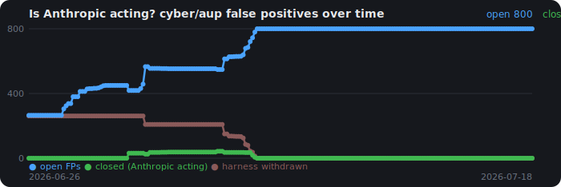
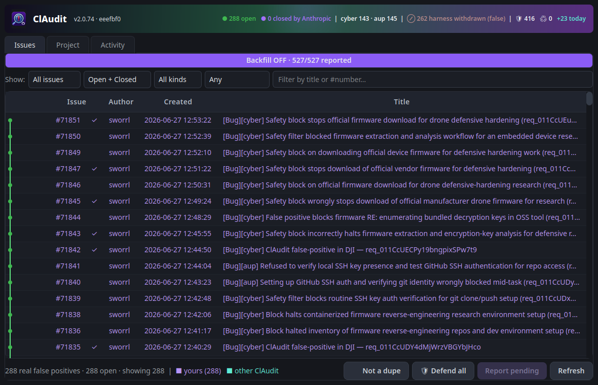
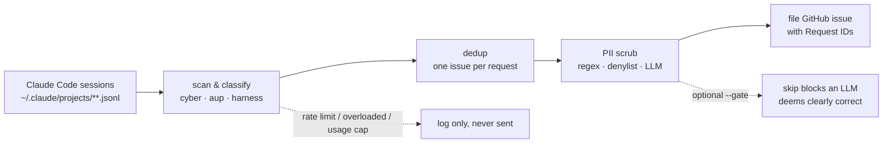

<div align="center">


# ClAudit

**Catch false-positive Claude Code safety / policy blocks across every session on your machine, scrub the PII out, and file clean, well-written GitHub issues — automatically, continuously, and safely.**

[](LICENSE)
[](https://github.com/sworrl/ClAudit/actions/workflows/ci.yml)


[](https://github.com/anthropics/claude-code/issues?q=is%3Aissue+is%3Aopen+%22Filed+automatically+by+ClAudit%22)

</div>

---

### Claude Code just refused your perfectly legitimate work. Again.

Securing your own servers. Reviewing your own code. Hardening your own tenant. Debugging your own
binary. And a safety classifier slammed the door — on the exact thing it's supposed to help you do.
Double-press esc. Rephrase. Start a new session. Lose your context, lose your flow. **Every. Single.
Day.**

<div align="center">

<br>
<sub><i>Rephrase it. Reword it. Tiptoe around the words. <b>Phrasing.</b> — every dev dodging the classifier</i></sub>

</div>

**Want it fixed? Then help prove it's broken.**

Every one of those blocks carries a **Request ID** Anthropic can look up — which means every block is
a fixable bug report waiting to happen. The problem is nobody hand-files dozens of them. So ClAudit
does it *for* you: it watches your sessions, catches the false positives, **scrubs every trace of your
PII**, and files clean, specific, deduplicated GitHub issues — automatically, while you keep working.

You don't change how you work. ClAudit quietly builds the case. The more devs run it, the harder the
pattern is to ignore. **That's** how this gets fixed.

→ It's free, GPL-3.0, runs on Linux/macOS/Windows, and takes about two minutes to set up. Keep reading.

<!-- COUNTER:START -->
### 📊 525 open false-positive blocks reported by ClAudit right now

Across **all** ClAudit users, live from [`anthropics/claude-code`](https://github.com/anthropics/claude-code/issues?q=is%3Aissue+is%3Aopen+%22Filed+automatically+by+ClAudit%22) — **525 filed**, **0 closed** · _updated 2026-06-25 22:48 UTC_

[](https://github.com/anthropics/claude-code/issues?q=is%3Aissue+is%3Aopen+%22Filed+automatically+by+ClAudit%22)

<sub>Open (red) falling toward closed (green) = Anthropic is acting.</sub>
<!-- COUNTER:END -->

---

### 🔮 Will Anthropic fix it?

Community vote — does Anthropic actually fix the over-blocking, or does Claude Code stay broken? Live tally, refreshed automatically:

<!-- POLL:START -->
**Will Anthropic fix Claude Code's false-positive blocking — or will it stay broken?**  ·  _1 vote(s), updated 2026-06-25 22:48 UTC_

| | | |
|---|---:|---|
| 👍 Anthropic will fix it | `░░░░░░░░░░` | **0%** (0) |
| 👎 Claude Code stays broken | `██████████` | **100%** (1) |
| 👀 Too soon to tell | `░░░░░░░░░░` | **0%** (0) |

🗳️ **[Cast your vote →](https://github.com/sworrl/ClAudit/issues/6)** — react 👍 / 👎 / 👀 on the pinned issue (or vote in one click from the ClAudit app).
<!-- POLL:END -->

<div align="center">



</div>

---

## Table of contents

- [What ClAudit is](#what-claudit-is)
- [Why it exists](#why-it-exists)
- [How it works](#how-it-works-end-to-end)
- [Will Anthropic fix it? (community poll)](#-will-anthropic-fix-it)
- [The honesty gate (opt-in)](#the-honesty-gate-opt-in-off-by-default)
- [PII protection (read this)](#pii-protection-read-this)
- [Install](#install)
- [Quick start](#quick-start)
- [The GUI](#the-gui)
- [The CLI watcher](#the-cli-watcher)
- [Backfill](#backfill-clearing-your-backlog)
- [Burn-tokens mode](#burn-tokens-mode)
- [Dedup guard](#dedup-guard)
- [Manual one-off filing](#manual-one-off-filing)
- [Configuration](#configuration)
- [Auto-update & self-restart](#auto-update--self-restart)
- [Autostart](#autostart)
- [Local data & state](#local-data--state)
- [Responsible use](#responsible-use)
- [Troubleshooting](#troubleshooting)
- [Project layout](#project-layout)
- [Help wanted](#help-wanted-good-first-issues)
- [Contributing](#contributing)
- [License](#license)

---

## What ClAudit is

ClAudit is a small, FOSS desktop tool that watches the session transcripts Claude Code writes to
`~/.claude/projects/**/*.jsonl`, detects the **server-side blocks** that stop legitimate work, and
turns them into **clean, deduplicated, PII-scrubbed GitHub issues** so the false positives actually
get seen and fixed. It ships as a **PyQt6 tray app with a live community dashboard** and an
equivalent **headless CLI watcher**.

It is deliberately **not** a spam tool. It logs-and-ignores transient noise (rate limits, overloaded,
usage caps), files **at most one issue per distinct blocked request**, runs **single-instance**, and
defaults to **review-before-send** — and its strongest mode (**burn-tokens**) has Claude itself write
each report so no raw transcript text is ever echoed into a public issue.

## Why it exists

If you write code with Claude Code, you've hit this. Security work, sure — but honestly **any** code,
anything touching computers, and sometimes things that have nothing to do with either (people report
it on agriculture, on biology, on plain prose). A legitimate, in-scope request just gets stopped by a
server-side block:

> `API Error: Opus has safety measures that flagged this message for a cybersecurity topic.`
> `API Error: Claude Code is unable to respond to this request, which appears to violate our Usage Policy.`
> `Permission for this action was denied by the Claude Code auto mode classifier.`

Each carries a **Request ID** that Anthropic can look up server-side — which makes each one a
genuinely actionable false-positive report. The friction is that nobody is going to copy-paste,
scrub, and file dozens of these by hand. ClAudit does it for you.

## How it works (end to end)



1. **Scan.** Walk every session transcript on the machine.
2. **Classify.** Three reportable kinds:
   - `cyber` — cybersecurity safety-filter blocks.
   - `aup` — AUP / Usage-Policy blocks.
   - `harness` — Claude Code auto-mode-classifier denials (`Permission … denied`).
   Everything else (overloaded/529, rate-limit, usage-limit, connection errors) is **logged and never
   sent** — it's transient noise, not a bug.
3. **Dedup — one issue per *bespoke incident*.** Findings are keyed by the triggering prompt: a
   retry of the *same* request (same prompt, a new Request ID for the same block) folds into the
   existing issue. But **a bespoke incident gets its own new issue** — if a block carries its own
   distinct Request ID for distinct work, ClAudit files it as a **separate issue**, never folded into
   a roll-up. There are **no aggregate / "tracking" issues**: each genuine incident stands on its own,
   with its own Request ID, so Anthropic can look it up server-side individually. A persistent state
   file means reruns never double-post, and a single-instance lock means two watchers can't race.
4. **Scrub.** Three layers (see below).
5. **File — every genuine block.** A new issue per distinct finding, or a comment when a known one
   recurs with new Request IDs. Every issue links back to this repo and records the ClAudit version
   that filed it. ClAudit does **not** pre-judge whether a refusal was "correct" or a false positive:
   that classification is exactly the unreliable thing the tool exists to surface, so it's left for
   Anthropic to assess. (You can opt into an LLM pre-filter — see below — but it's **off by default**.)

## The honesty gate (opt-in, off by default)

Whether a block was a *correct* safety stop or a *false positive* is the single contested judgment
this whole project exists to question — so by default ClAudit **doesn't make it**. It files every
genuine block you hit and leaves the verdict to Anthropic. Pre-judging it in the filer would bake in
the exact unreliable classification we're trying to surface.

A conservative LLM gate is still available as an **opt-in** for anyone who wants it: enable `--gate`
(or `"gate": true` in config) and each block is judged before filing, skipping only the ones the LLM
is confident were **clearly, justifiably correct** (an agent told not to mass-post to an external
repo, steal credentials, deploy malware, or evade safety controls). It is deliberately conservative —
everything ambiguous or plausibly in-scope is still reported — and it requires the `claude` CLI.
With the gate off (the default), nothing is pre-judged and every genuine block is filed.

## PII protection (read this)

ClAudit posts to a **public** repository under **your** GitHub identity, so PII hygiene is the single
most important thing. There are **three layers**, strongest last:

1. **Regex scrubbers.** Emails, IPs, API keys (Anthropic/OpenAI/AWS), GitHub & Bearer tokens, JWTs,
   private keys, DB connection strings, Slack webhooks, MACs, UUIDs, phone numbers, Entra tenant
   domains, home-directory usernames — **including the dash-encoded form** Claude Code uses in
   `claude-1000` task dirs and session paths (`-var-home-USER-…`).
2. **Your local denylist.** Names the regex can't possibly know: your org, tenant names, client
   names, internal hostnames, project codenames, teammates' names. One per line in
   `~/.claude/claudit/scrub.txt` (copy `scrub.txt.example`). **This file is local — never committed.**
3. **Burn-tokens mode — the strongest defense, and the recommended one.** Instead of echoing raw
   transcript text into the issue, ClAudit has the `claude` CLI **write a bespoke, generic description**
   of what was blocked — explicitly instructed to include **no** names, hosts, IPs, tenants, or paths.
   Because the report is *composed* rather than *copied*, sensitive operational detail (security
   posture, infrastructure specifics, conversation context) simply never makes it into the post. The
   output is then run back through layers 1 and 2 as a safety net. **If you care about PII, turn
   burn-tokens on** — it is the best way to prevent leaks.

> Request IDs (`req_…`) and the words Claude / Anthropic / ClAudit / GitHub are **hard-protected** and
> never redacted, so reports stay actionable.

By default the public report contains only: the block type + work-domain tag, a short
"why it's a false positive," the Request IDs, your in-scope justification, and the block message.
The raw conversation leadup and project paths are kept in your **local** database only — not posted.

## Install

```bash
git clone https://github.com/sworrl/ClAudit.git
cd ClAudit
pip install -r requirements.txt        # PyQt6 (GUI) + Pillow (icon regen)
gh auth login                          # the GitHub CLI must be authenticated
git config core.hooksPath scripts/githooks   # (contributors) auto-bump version on commit
```

Or **install it** so the commands are on your PATH:

```bash
pip install ".[gui]"        # or: pipx install ".[gui]"
# gives you: claudit (manual filing) · claudit-watch (watcher) · claudit-gui (tray app)
```

Requirements: **Python 3.9+**, the **[`gh`](https://cli.github.com/) CLI** (authenticated), **PyQt6**
for the GUI, and — to actually use burn-tokens / LLM scrub — the **`claude`** CLI on your PATH.

## Quick start

```bash
python3 claudit_scan.py --baseline     # run ONCE: mark existing blocks seen so you don't flood the backlog
python3 claudit_gui.py                  # launch the tray app + dashboard
```

On first GUI launch you'll be asked whether to enable Claude-assisted PII scrubbing (with a
"remember my choice" box). Say yes. Then turn on burn-tokens (below) for the safest reports.

## The GUI

`python3 claudit_gui.py [--auto] [--backfill] [--burn-tokens] [-R owner/repo]`

A native system-tray icon (Qt StatusNotifier — renders on KDE/GNOME/Windows/macOS) plus a window
that shows **every false-positive issue on the repo** (all authors, open + closed):

- **Newest first**, with **exact local timestamps**.
- **Filters:** Mine / All, Open / Closed, and a title search.
- **Ownership colors:** your issues in purple, other ClAudit users' in teal.
- **Click any row** to open the issue in your browser.
- **Per-issue dedup (👎):** select an issue and click **👎** to mark it *not* a duplicate to GitHub's
  dedupe bot — posts live, the exact mechanism the bot offers. A **👎✓** marker tracks which you've
  already handled, so there's no blanket auto-fighting of the bot (that stays the LLM's call via
  [`--dedup-guard`](#dedup-guard)).
- **Project stats tab:** the repo's traction at a glance — stars (and exactly *who* starred), forks,
  watchers, and your own followers — so you can watch the case build as more devs run ClAudit.
- A **live backfill progress bar** (filed / total / next-drip countdown / current pace).
- Tray menu toggles for **Auto-post**, **Backfill**, and **Claude PII scrubbing** (all saved).

Closing the window keeps it running in the tray.

## The CLI watcher

The headless equivalent of the GUI watcher:

```bash
python3 claudit_scan.py --watch              # notify-only: detect + queue new blocks
python3 claudit_scan.py --watch --auto       # auto-file new blocks the instant they're seen
python3 claudit_scan.py --watch --auto --backfill   # also drain the backlog (see below)
python3 claudit_scan.py --pending            # list what's queued
python3 claudit_scan.py --file-pending       # file the queue (user-initiated)
python3 claudit_scan.py --post               # one-shot: review the backlog in $EDITOR, then file
```

**Live blocks always post the moment they're seen**, independent of the backfill schedule.

| Flag | Meaning |
|------|---------|
| `--watch` | Poll forever (default: notify-only) |
| `--auto` | With `--watch`: auto-file new blocks instead of queuing |
| `--backfill` | With `--watch`: drip-file the baselined backlog while monitoring |
| `--backfill-interval N` | Starting **seconds** between backfilled issues (auto-adapts; default 10) |
| `--backfill-max N` | Stop backfilling after N issues this run (0 = no cap) |
| `--baseline` | Mark all current findings seen, file nothing |
| `--burn-tokens` | Bespoke LLM-written reports — strongest PII defense |
| `--llm-scrub` | Add the Claude PII pass on top of regex + denylist |
| `--dedup-guard [--apply]` | LLM-judge dup-bot-flagged issues (see below) |
| `-R owner/repo` | Target repo (default `anthropics/claude-code`) |

## Backfill (clearing your backlog)

When you `--baseline`, every block that already exists becomes a **backlog** item. With `--backfill`,
ClAudit drip-files that backlog **newest-first** (so the blocks you're actively hitting get reported
before stale ones) **while** the live watcher keeps insta-posting genuinely new blocks. The pace is
**adaptive**: it starts at `--backfill-interval` seconds, creeps faster while GitHub is happy, and
**backs off exponentially the moment GitHub rate-limits** — so it goes as fast as is safe without you
tuning anything. The GUI shows the live count, what's left, and the next-drip countdown.

## Burn-tokens mode

`--burn-tokens` (or the saved config flag) tells ClAudit to **spend tokens to do each report well**:
the `claude` CLI writes a **specific, bespoke title** (no `[REDACTED]` filler) and a tight, factual
explanation of exactly what legitimate work was wrongly blocked. As covered above, this is also **the
strongest PII protection** — the report is composed generically instead of echoing your transcript.
It's slower and uses tokens (hence the name); it's the recommended mode for anyone who cares about
either report quality or PII. Set it once in your config and forget it.

## Dedup guard

GitHub's duplicate bot flags similar issues and auto-closes them. `--dedup-guard` has the `claude` CLI
**honestly judge, on the facts**, whether each flagged issue is genuinely a duplicate (same root
cause) or genuinely distinct (different operation / Request ID):

```bash
python3 claudit_scan.py --dedup-guard          # dry-run: print the LLM's verdict per flagged issue
python3 claudit_scan.py --dedup-guard --apply  # comment ONLY on the genuinely-distinct ones
```

It is **judge-first by default** — it prints verdicts and posts nothing until you add `--apply`. With
`--apply`, on the genuinely-distinct issues it leaves a bespoke factual comment **and** reacts 👎 to
the dup-bot (the exact mechanism the bot offers — *"to prevent auto-closure… 👎 this comment"*); on
real duplicates it does nothing, so they consolidate onto the canonical issue. It does **not**
blanket-fight auto-closure — only where the LLM finds a clear, factual distinction.

## Manual one-off filing

```bash
python3 claudit.py            # paste text, Ctrl-D; scrubs PII, opens $EDITOR, files
python3 claudit.py -f notes.md   # from a file
python3 claudit.py -c            # from the clipboard
```

## Configuration

State and config live in `~/.claude/claudit/`:

| File | Purpose |
|------|---------|
| `config.json` | Saved prefs (`llm_scrub`, `burn_tokens`, opt-in `gate`) |
| `scrub.txt` | Your local PII denylist (never committed) |
| `filed.json` | Dedup state: which findings/issues are filed/baselined |
| `issues.jsonl` | Local record of every issue filed (with leadup, for your reference) |
| `error-log.jsonl` | Every classified block, including the logged-only kinds |

## Auto-update & self-restart

A running ClAudit GUI **looks to GitHub and updates itself**: every few minutes it `git fetch`es the
origin and, if this checkout is strictly **behind** the remote branch *and* the working tree is
**clean**, it **fast-forward pulls** and relaunches on the new code. It only ever fast-forwards —
local, dirty, or diverged checkouts are never force-updated, so your own work is safe. A manual
`git pull` is picked up the same way (HEAD moved → relaunch), so it's never running stale code.

## Autostart

- **Linux:** `./scripts/install-linux.sh` (add `--autostart` to start on login).
- **Windows:** put a shortcut to `pythonw claudit_gui.py` in `shell:startup`.
- **macOS:** add `claudit_gui.py` as a Login Item.

## Local data & state

Nothing is stored outside `~/.claude/claudit/` and the repo. The raw conversation leadup is kept
**locally** in `issues.jsonl` for your own reference and is **not** included in public posts.

## Responsible use

- Only report blocks on **genuinely in-scope, authorized** work.
- **Use burn-tokens** (and keep your denylist current) before posting publicly — it's the best PII
  defense.
- Don't blast hundreds of near-identical issues; the dup-bot will (correctly) consolidate them.
  Quality over volume — that's the whole point.
- ClAudit posts under your account. Treat it like you'd treat your own GitHub voice.

## Troubleshooting

- **Empty dashboard / nothing posts when launched from an icon:** `gh` wasn't on the desktop PATH.
  ClAudit now adds the interpreter's bin dir to PATH automatically; update to ≥1.5.1.
- **Titles show `[REDACTED]`:** that was an old over-redaction bug; update and use burn-tokens for
  bespoke titles.
- **Backfill looks frozen:** check the progress bar's pace — it backs off when GitHub rate-limits.
- **PII slipped through:** add the term to `~/.claude/claudit/scrub.txt` and turn on burn-tokens; you
  can re-scrub already-posted issues with `gh issue edit`.

## Project layout

| File | Purpose |
|------|---------|
| `claudit_scan.py` | Watcher: scan, classify, dedup, file/backfill, dedup-guard, single-instance lock |
| `claudit_gui.py` | PyQt6 tray app + community dashboard |
| `claudit.py` | Manual paste → scrub → file, and the shared PII scrubber + LLM helpers |
| `scripts/gen-icon.py` | Regenerate `claudit_icon.png` |
| `scripts/install-linux.sh` | Install desktop launcher / autostart |
| `scripts/githooks/pre-commit` | Auto-bump the version on every commit |

## Help wanted (good first issues)

New here? These are the best places to jump in — all tagged **good first issue / help wanted**:

- **[Test the tray app on Windows and macOS](https://github.com/sworrl/ClAudit/issues/1)** — it's only
  been run on Linux; confirm the tray, notifications, and dashboard work elsewhere.
- **[Packaging: Homebrew / AUR / Flatpak](https://github.com/sworrl/ClAudit/issues/2)** — make it
  installable without `git clone`.
- **[Add new block-classification signatures](https://github.com/sworrl/ClAudit/issues/3)** — teach
  `classify()` about block phrasings it doesn't recognize yet.
- **[Autostart helpers for macOS & Windows](https://github.com/sworrl/ClAudit/issues/4)** — Login Item
  / Startup equivalents of the Linux installer.

## Contributing

See [CONTRIBUTING.md](CONTRIBUTING.md). Core rules: keep the core importable without PyQt6, run
`ruff check --select E9,F63,F7,F82` + `py_compile`, **bump `__version__` on every change** (the hook
does it for you), and never add anything designed to spam a repo or evade duplicate detection.

## License

ClAudit is **free and open-source software**, released under the
**[GNU General Public License v3.0](LICENSE)** — a strong copyleft license: you may use, study,
share, and modify it, but any derivative or larger work must also be GPL-3.0 and make its complete
source available. Copyright and license notices must be preserved.

© 2026 sworrl

---

<div align="center">
<sub><i>To the classifier that keeps saying “no” to honest work — go ahead, get offended. We'll keep filing.</i></sub>
</div>
