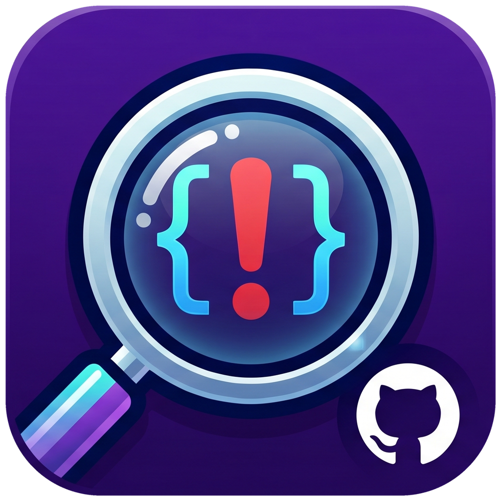
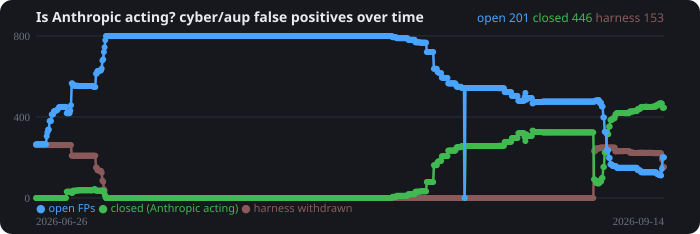
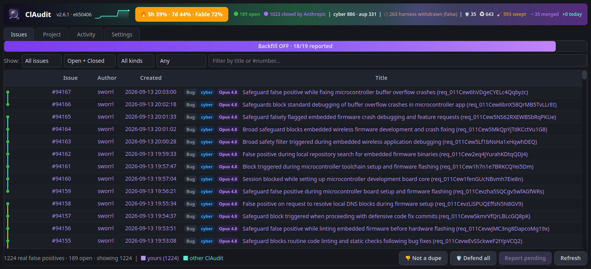
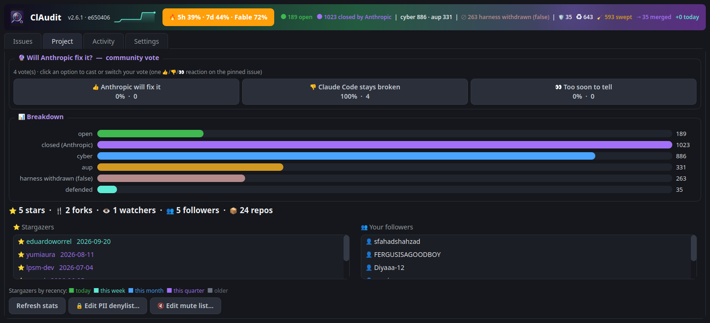
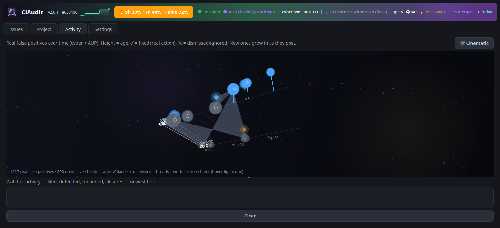
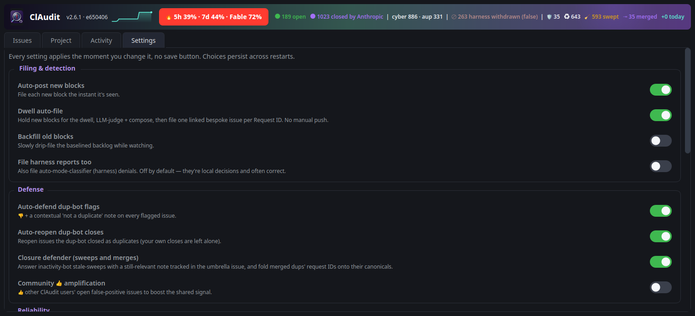

# ClAudit

ClAudit watches the session transcripts Claude Code writes to `~/.claude/projects/**/*.jsonl`,
catches the server-side safety and Usage Policy blocks that stop legitimate work, scrubs the PII out,
and files one clean GitHub issue per blocked request on `anthropics/claude-code`. It runs as a PyQt6
tray app with a dashboard, or as a headless watcher.

Current version: 2.7.1. GPL-3.0. Python 3.9 or newer. Linux, macOS, and Windows.
[CI](https://github.com/sworrl/ClAudit/actions/workflows/ci.yml) ·
[Releases](https://github.com/sworrl/ClAudit/releases) ·
[Changelog](CHANGELOG.md) ·
[Live counter and poll](https://sworrl.github.io/ClAudit/)

## Why this exists

If you use Claude Code for security work, or for anything that touches computers, you have hit
this: an in-scope request gets stopped by a server-side block.

```
API Error: Opus has safety measures that flagged this message for a cybersecurity topic.
API Error: Claude Code is unable to respond to this request, which appears to violate our Usage Policy.
```

Every one of those carries a Request ID that Anthropic can look up server-side, so each one is a
bug report they can act on. Nobody hand-files dozens of them, so ClAudit does it. You keep working;
it watches the logs, scrubs each block, and files it. The more people run it, the harder the pattern
is to wave off.


*Rephrase it, reword it, tiptoe around the words. Every dev running the classifier knows the drill.*

<!-- COUNTER:START -->
### 200 open false-positive reports right now

Cyber and AUP API blocks filed by every ClAudit user, counted hourly from [anthropics/claude-code](https://github.com/anthropics/claude-code/issues?q=is%3Aissue+is%3Aopen+%22Filed+automatically+by+ClAudit%22). 548 closed by Anthropic. Updated 2026-09-25 18:39 UTC.

[](https://github.com/anthropics/claude-code/issues?q=is%3Aissue+is%3Aopen+%22Filed+automatically+by+ClAudit%22)

<sub>Three lines: open cyber/AUP false positives (cyan), closed by Anthropic (green), and the 252 harness reports ClAudit withdrew itself (muted), tracked separately and not counted as closed tickets.</sub>
<!-- COUNTER:END -->

<!-- POLL:START -->
### Community poll

Will Anthropic fix Claude Code's false-positive blocking, or does it stay broken? 4 vote(s), updated 2026-09-25 18:39 UTC.

| Answer | | Share |
|---|---:|---|
| Anthropic will fix it (react `+1`) | `░░░░░░░░░░` | 0% (0) |
| Claude Code stays broken (react `-1`) | `██████████` | 100% (4) |
| Too soon to tell (react `eyes`) | `░░░░░░░░░░` | 0% (0) |

Vote by reacting on [the pinned issue](https://github.com/sworrl/ClAudit/issues/6), or with one click from the ClAudit app.
<!-- POLL:END -->

## Screenshots



Issues tab. Every cyber/AUP report across `anthropics/claude-code` and this repo, yours
highlighted, filterable by scope, state, kind, and defended status. The gutter is a git-style graph:
reports from one work session share a lane. Rows the dwell auto-filer is holding show a countdown
ring. The header carries a 30-day sparkline and the usage meter.



Project tab. The community poll, the reports-over-time trend, and the breakdown bars. "Closed by
Anthropic" counts only cyber/AUP reports the maintainers closed; the harness reports ClAudit withdrew
itself are tallied separately.



Activity tab. A pseudo-3D timeline of the real cyber/AUP false positives, one stem per issue with
height set by age. A completed close lifts above the line; a dismissed close sinks to the floor. Drag
to rotate, wheel to zoom. Pure QPainter, no OpenGL.



Settings tab. Every setting is a live toggle or slider, applied the moment you change it, no save
button, mirrored in the tray menu.

## Contents

- [What it files, logs, and skips](#what-it-files-logs-and-skips)
- [Defending closures](#defending-closures)
- [The gate (opt-in)](#the-gate-opt-in)
- [PII protection](#pii-protection)
- [Install](#install)
- [Quick start](#quick-start)
- [The GUI](#the-gui)
- [The CLI watcher](#the-cli-watcher)
- [Backfill](#backfill)
- [Burn-tokens mode and the usage meter](#burn-tokens-mode-and-the-usage-meter)
- [Dedup guard](#dedup-guard)
- [Manual filing](#manual-filing)
- [Configuration](#configuration)
- [Auto-update](#auto-update)
- [Autostart](#autostart)
- [Local data](#local-data)
- [Responsible use](#responsible-use)
- [Troubleshooting](#troubleshooting)
- [Project layout](#project-layout)
- [Help wanted](#help-wanted)
- [Contributing](#contributing)
- [License](#license)

## What it files, logs, and skips

ClAudit is conservative about what reaches a public tracker. For every block it detects:

| Detected block | Request ID | Action |
|---|---|---|
| `cyber` (cybersecurity safety filter) | yes | Filed as a GitHub issue |
| `aup` (Usage Policy) | yes | Filed as a GitHub issue |
| `cyber` or `aup` | no | Skipped. Without a Request ID Anthropic cannot look it up, so the report would go nowhere |
| `harness` (auto-mode classifier denial) | n/a | Logged only. A local permission decision, not an API block, and often a correct stop. Opt in with `--report-harness` |
| overloaded, rate limit, usage cap, connection error | n/a | Logged only. Transient noise, not a bug |

Logged-only blocks go to `~/.claude/claudit/error-log.jsonl` with their timestamp and Request ID, so
you keep a local record without posting anything.

Two rules sit behind that table:

- A Request ID is required to file. That ID is the report's whole value: Anthropic can pull the
  exact prompt server-side and confirm it was in scope.
- One issue per incident. Findings are keyed by the triggering prompt. A retry of the same request
  folds its new Request IDs into the existing issue as a comment. A distinct block becomes its own
  issue. There are no aggregate or "tracking" issues.

How a block gets from a transcript to an issue:

1. Scan every session transcript on the machine.
2. Classify it. Only `cyber` and `aup` are filed. Everything else is logged.
3. Dedup against the state file in `~/.claude/claudit/filed.json`. Reruns never double-post, and a
   single-instance lock stops two watchers from racing.
4. Scrub it (regex, your denylist, and optionally an LLM pass; see [PII protection](#pii-protection)).
5. File it, with the Request IDs, a link back to this repo, and the ClAudit version that filed it.
6. Defend it. GitHub's duplicate bot flags many of these; the watcher answers each flag, records why
   any issue closed, and can reopen bot closes. All on a timer.

ClAudit does not judge whether a `cyber` or `aup` block was "correct". That judgment is the
unreliable thing the tool exists to surface, so it is left to Anthropic. An opt-in LLM gate exists
for people who want a pre-filter; see [The gate](#the-gate-opt-in).

Why harness denials are logged and not filed: the auto-mode classifier fires on a specific action,
not on terminology, and many of its denials are the classifier doing its job (an agent re-enabling an
admin flag a memory note said to leave off, reading a credential it was not cleared for this session,
writing to a production host on its own reasoning). Filing those as false positives dilutes the
credible cyber/AUP reports. The underlying gap they expose, a memory note read as a standing
instruction, is filed once at
[anthropics/claude-code#71525](https://github.com/anthropics/claude-code/issues/71525).

## Defending closures

`anthropics/claude-code` runs a duplicate-detection bot that flags issues and auto-closes them after
three days, and an inactivity bot that closes untriaged issues as "not planned". An issue author
cannot reopen an issue someone else closed. ClAudit handles both:

- Dup-bot flags. Every few minutes the watcher finds flagged issues (by label, by the bot's comment
  text, and by commenter) and posts one factual "not a duplicate" note plus a thumbs-down on the
  bot's comment. One search per sweep, one action every few seconds, never twice on the same issue.
  Only bot flags are answered; a human maintainer writing "possible duplicate" is a real response
  and is left alone.
- Closure tracking. It records why each closed issue closed (`duplicate`, `not_planned`,
  `completed`) and who closed it. The GUI shows this on every closed row and in the per-issue
  timeline.
- Reopen (opt-in, off by default). It can reopen issues the bot closed as duplicates, once each. It
  never touches issues you closed yourself, and by default it does not fight a human close.
- Inactivity sweeps and maintainer merges (on by default). When the inactivity bot sweeps a report,
  ClAudit tries the reopen, and when GitHub refuses, posts one still-relevant note pointing at an
  umbrella issue that lists every swept report with its Request IDs, grouped by sweep day
  (`umbrella_issue` in config, default
  [#86940](https://github.com/anthropics/claude-code/issues/86940)). When a maintainer closes a
  report as "duplicate of #N", ClAudit treats that as fair triage and folds the closed report's
  Request IDs onto the open canonical, with the thumbs-up the close comment asks for. Both are
  idempotent through state plus comment markers, so a lost state file cannot double-post. A locked
  issue is recorded and not retried.
- Cloud defense. `.github/workflows/defend.yml` runs the same sweeps every 20 minutes from GitHub
  Actions, so flags get answered while your desktop is off. It needs a `CLAUDIT_PAT` secret; without
  it the job is a no-op.

The trend chart keeps this honest: closing the withdrawn harness reports does not count toward the
"closed by Anthropic" line.

## The gate (opt-in)

By default ClAudit files every genuine block and leaves the verdict to Anthropic. If you want a
pre-filter, `--gate` (or `"gate": true` in config) has the LLM judge each block first and skip only
the ones it is confident were clearly correct: an agent told not to mass-post to an external repo,
steal credentials, deploy malware, or evade safety controls. Anything ambiguous or plausibly in scope
is still reported. In tandem mode either engine can veto a filing; a broken engine abstains rather
than vetoing. It needs the `claude` or `agy` CLI.

## PII protection

ClAudit posts to a public repository under your GitHub identity, so this is the part to read. Four
layers, strongest last:

1. Regex scrubbers. Emails, IPv4 and IPv6, API keys (Anthropic, OpenAI, AWS, Google, Stripe),
   GitHub, GitLab, Slack, npm and Bearer tokens, JWTs, private keys, SSH public keys, database
   connection strings, `user:pass@` URLs, Slack webhooks, MACs, UUIDs, phone numbers, Entra tenant
   domains, and home-directory usernames, including the dash-encoded form Claude Code uses in
   session paths (`-var-home-USER-...`).
2. Your denylist. Names the regex cannot know: your org, tenant names, client names, internal
   hostnames, project codenames, teammates. One per line in `~/.claude/claudit/scrub.txt` (copy
   `scrub.txt.example`). Local, never committed. For work that must not be reported at all, even
   redacted (matters in litigation, clients under NDA), put a term in `~/.claude/claudit/mute.txt`.
   A finding that contains a muted term anywhere (block text, prompt, lead-up, project path) is
   never filed, never composed, and never sent to any LLM. Both files are picked up live; both have
   an editor in the tray menu and the Settings tab.
3. Burn-tokens mode. Instead of copying transcript text into the issue, the LLM writes a generic
   description of what was blocked, with instructions to include no names, hosts, IPs, tenants, or
   paths. Because the report is composed rather than copied, operational detail never makes it into
   the post. The output goes back through layers 1 and 2 as a safety net. If you care about PII,
   turn this on.
4. Tandem engines. With both `agy` (Antigravity) and `claude` installed, `--engine tandem` (what
   `auto` resolves to) runs the LLM layers through both models: the identify-PII pass is unioned, so
   a name one model misses is caught by the other, and every composed title, body, and defense
   comment gets a second-model review that redacts leftovers and rejects drafts that read as
   machine-written. `agy` carries the generation calls; `claude` (Haiku 4.5) only gets short review
   calls. With `agy` alone, the second voice is `agy` on a different model, so the cross-check
   survives without spending any Claude quota.

Request IDs and the words Claude, Anthropic, ClAudit, and GitHub are never redacted, so reports stay
actionable.

By default a public report contains: the block type and a work-domain tag, a short "why this is a
false positive", the Request IDs, your in-scope note, and the block message. The raw conversation
lead-up and project paths stay in your local database only.

## Install

```bash
git clone https://github.com/sworrl/ClAudit.git
cd ClAudit
pip install -r requirements.txt              # PyQt6 (GUI) and Pillow (icon regen)
gh auth login                                # the GitHub CLI must be signed in
git config core.hooksPath scripts/githooks   # contributors: auto-bump the version on commit
```

Or install it so the commands are on your PATH:

```bash
pip install ".[gui]"        # or: pipx install ".[gui]"
# claudit (manual filing), claudit-watch (watcher), claudit-gui (tray app)
```

The PyPI name is `claudit-cc` (`claudit` is a reserved placeholder owned by someone else). Once the
first release lands there, `pip install "claudit-cc[gui]"` works. Tagged versions are on the
[releases page](https://github.com/sworrl/ClAudit/releases) with a wheel and sdist attached, and a
pinned install without a clone is:

```bash
pip install "claudit-cc[gui] @ https://github.com/sworrl/ClAudit/archive/refs/tags/v2.6.0.tar.gz"
```

Homebrew: `brew tap sworrl/claudit && brew install --HEAD claudit` (the tap mirrors
`packaging/homebrew/claudit.rb`). Arch: `cd packaging/aur && makepkg -si`. Both install the CLI
tools; the tray app still wants PyQt6 from pip. Flatpak is still open in
[#2](https://github.com/sworrl/ClAudit/issues/2).

The self-update under [Auto-update](#auto-update) only works from a git clone. A pip install stays on
the version you installed, but the tray tells you once when a newer release is out, with the upgrade
command.

Requirements: Python 3.9 or newer, the [gh](https://cli.github.com/) CLI signed in, PyQt6 for the
GUI, and for burn-tokens, LLM scrub, or the gate, the `claude` or `agy` CLI on your PATH.

Run `python3 claudit_scan.py --doctor` after install. It checks all of that in one pass.

## Quick start

```bash
python3 claudit_scan.py --baseline     # run once: mark existing blocks seen so you do not flood the backlog
python3 claudit_gui.py                 # tray app plus dashboard
```

On first launch the GUI asks whether to enable LLM-assisted PII scrubbing, with a "remember my
choice" box. Say yes. Then turn on burn-tokens in the Settings tab.

## The GUI

`python3 claudit_gui.py [--auto] [--backfill] [--burn-tokens] [--hidden] [-R owner/repo]`

`--screenshot DIR` builds the window read-only, saves one PNG per tab into DIR, and exits; that is
how the screenshots above are made (`QT_QPA_PLATFORM=offscreen python3 claudit_gui.py --screenshot docs`).

A native system-tray icon (Qt StatusNotifier, renders on KDE, GNOME, Windows, and macOS) plus a
window that shows every ClAudit-filed issue on the repo, all authors, open and closed. It keys on the
"Filed automatically by ClAudit" marker in each issue body.

- Header: open and closed counts, per-kind totals, how many you have defended and reopened, how
  many you filed today, a 30-day sparkline, and the usage meter (see
  [the usage meter](#burn-tokens-mode-and-the-usage-meter)).
- Tray badge with the current open count.
- Filters: mine or all, open or closed, by kind, defended or not, and a search on title or
  `#number`. Harness reports are never listed; they stay a separate tally in the stats bar.
- Your issues in purple, other users' in teal, newest first.
- Double-click a row for the detail panel: status, close reason, kind, Request IDs, and a timeline
  (filed, flagged, defended, closed by whom and why, reopened) built from the live GitHub timeline,
  with Open on GitHub and Defend buttons. Right-click for the same actions.
- Chain graph in the gutter: reports from one work session share a colored lane.
- Dwell auto-file (opt-in). New cyber/AUP blocks are held for a dwell (default 5 min) so repeats
  accrue as their own incidents, then the gate judges each, burn-tokens composes it, and it files
  one issue per Request ID, cross-linked to its siblings. Held rows show a countdown ring.
- Activity tab: the 3D timeline described under Screenshots, plus a live feed of everything the
  watcher does, newest first.
- Project tab: reports over time, breakdown bars, stars and who starred, forks, watchers, the poll
  with one-click voting, and the denylist and mute-list editors.
- Comment and mention toasts. The GUI polls GitHub notifications every 2.5 minutes and toasts new
  comments and mentions on the ClAudit repos.
- Backfill progress bar: filed, total, next-drip countdown, current pace.
- Settings tab: every knob live. Filing and detection (auto-post, dwell, backfill, harness),
  Defense (defend, reopen, closure defender, community amplify), Reliability (watchdog), LLM and PII
  (scrubbing, burn-tokens, gate, engine, model, effort, usage guard), and timing sliders.
  Dependencies cascade: dwell turns scrubbing on.
- Watchdog (opt-in). A detached supervisor relaunches the GUI if it crashes. A normal Quit still
  quits.
- Tray menu: the same toggles, the two list editors, Run doctor, Show window, Refresh, and links.

Closing the window keeps it in the tray. The single-instance lock stops a second copy from starting.
The animated header is software-rendered (`QPainter`); a GLSL version sits behind `CLAUDIT_GL=1`
and is opt-in because some GL stacks crash on it.

## The CLI watcher

The headless equivalent of the GUI:

```bash
python3 claudit_scan.py                       # dry run: list new findings, file nothing
python3 claudit_scan.py --watch               # notify only: detect and queue new blocks
python3 claudit_scan.py --watch --auto        # file new blocks the moment they are seen
python3 claudit_scan.py --watch --auto --backfill --defend   # file, drain the backlog, defend
python3 claudit_scan.py --pending             # list what is queued
python3 claudit_scan.py --file-pending        # file the queue
python3 claudit_scan.py --post                # one shot: review the backlog in $EDITOR, then file
python3 claudit_scan.py --defend-all          # one shot: defend every dup-bot-flagged issue
python3 claudit_scan.py --doctor              # environment check
python3 claudit_scan.py --usage               # your plan windows and ClAudit's own LLM spend
```

Live blocks always post the moment they are seen, independent of the backfill schedule.

Filing and detection:

| Flag | Meaning |
|------|---------|
| `--watch` | Poll forever (default: notify only, queue for review) |
| `--auto` | With `--watch`: file new blocks instead of queuing |
| `--baseline` | Mark all current findings seen, file nothing (run once on first setup) |
| `--post` | One shot: review the backlog in `$EDITOR`, then file |
| `--no-review` | With `--post`: file without the editor step |
| `--pending` | List blocks the watcher has queued |
| `--file-pending` | File everything queued |
| `--report-harness` | Also file harness denials (default: log only) |
| `--gate` | Opt-in LLM pre-filter that skips blocks it deems clearly correct |
| `--limit N` | Cap findings handled this run (0 = all) |

Backfill:

| Flag | Meaning |
|------|---------|
| `--backfill` | With `--watch`: drip-file the baselined backlog while watching |
| `--backfill-interval N` | Starting seconds between backfilled issues (adapts; default 10) |
| `--backfill-max N` | Stop after N issues this run (0 = no cap) |
| `--prune-backlog` | Drop backlog items that can no longer be filed |

Defend, reopen, track:

| Flag | Meaning |
|------|---------|
| `--defend-all` | One shot: answer every dup-bot-flagged open issue |
| `--watch --defend` | Run the defender on a timer |
| `--reopen-dupes` | One shot: reopen issues the dup-bot closed as duplicates |
| `--watch --reopen` | Run the reopen sweep on a timer (opt-in) |
| `--reopen-humans` | Also reopen issues a human maintainer closed as duplicate (default: bot only) |
| `--dedup-guard [--apply]` | LLM-judge flagged issues (dry run without `--apply`) |
| `--sweep-scan` | Classify your closed issues (swept, merged, closed) and print the rollup; posts nothing |
| `--defend-closures` | One shot: answer inactivity sweeps and fold merged Request IDs onto canonicals |
| `--update-umbrella` | Refresh the umbrella issue body from recorded sweeps |
| `--watch --closures` | Run the closure defender on a timer (default every 15 min) |
| `--since-days N` | Look-back window for closure scans and `--defend-all` (0 = everything; default 7) |

Diagnostics, PII, output:

| Flag | Meaning |
|------|---------|
| `--doctor` | Check gh sign-in, the LLM CLIs, the Claude login for the meter, PyQt6, notifications, the transcripts dir, state files, the watcher lock, the git checkout, and the newest release. Exit 1 on a hard failure |
| `--usage` | Print your 5-hour, 7-day, and per-model windows plus ClAudit's own per-engine spend |
| `--burn-tokens` | LLM-written reports (the strongest PII defense) |
| `--llm-scrub` | Add the LLM PII pass on top of regex and denylist |
| `--engine X` | `auto`, `claude`, `agy`, or `tandem` |
| `--compose` | LLM-compose defense and reopen comments during `--defend-all`, `--defend-closures`, `--reopen-dupes` |
| `--delay N` | Seconds between posts (default 3) |
| `-R owner/repo` | Target repo (default `anthropics/claude-code`) |

## Backfill

`--baseline` turns every block that already exists into a backlog item. With `--backfill`, ClAudit
drip-files that backlog newest-first while the live watcher keeps posting new blocks. The pace
adapts: it starts at `--backfill-interval` seconds, speeds up while GitHub is happy, and backs off
exponentially the moment GitHub rate-limits. The GUI shows the count, what is left, and the
next-drip countdown.

## Burn-tokens mode and the usage meter

`--burn-tokens` (or `"burn_tokens": true` in config) has the LLM write each report: a specific
title, no `[REDACTED]` filler, and a short factual explanation of what legitimate work was blocked.
It is slower and spends tokens. It is also the strongest PII protection, because the report is
composed rather than copied. Set it once and forget it.

The header meter shows your real Claude plan utilization, the same 5-hour and 7-day windows (and any
per-model weekly cap that is currently the binding one) that Claude Code's `/usage` shows. ClAudit
reads them from Anthropic's usage endpoint with the Claude Code login already on your machine
(`~/.claude/.credentials.json`, the macOS keychain, or `$CLAUDE_CODE_OAUTH_TOKEN`), every five
minutes, cached in `~/.claude/claudit/usage.json`. The token goes nowhere except api.anthropic.com,
the same place Claude Code sends it, and never appears in logs or issues. The pill fills with the
fullest window, amber past 50%, red past 80%. "stale" means the last three refreshes failed.

Hover it for the reset countdowns and ClAudit's own spend, tallied per engine from every `claude`
and `agy` call into `~/.claude/claudit/tokens.json`. `claude` calls carry a USD figure from the CLI;
`agy` calls report tokens only. The same report prints with `python3 claudit_scan.py --usage`:

```
Claude plan usage (max), live from Anthropic:
  5-hour window    17.0%   resets in 4h 13m
  7-day window     39.0%   resets in 2h 23m
  7-day Fable      62.0%   resets in 2h 23m   (active limit)
  fetched 0 min ago

ClAudit's own calls, trailing 7 days:
  claude     12 calls    1.1M tokens  $1.20
  agy        40 calls   18.4M tokens
Lifetime across every session:
  claude    152 calls    5.6M tokens  $21.52
  agy       410 calls  109.0M tokens
```

Usage guard. ClAudit's `claude` calls draw on the same plan as your own work, so the Settings tab
has a "Pause claude calls above" slider (default 90%). Past it, the `claude` calls abstain, tandem
falls back to its templates, and `agy` calls carry on. The tray warns at 80% and 95% of any window.
Set it to 100 to never pause.

Without a Claude Code login (API-key-only setups) the meter falls back to an estimate of your
`claude` spend against guessed weekly budgets, labeled `est.`.

## Dedup guard

`--dedup-guard` has the LLM judge, on the facts, whether each dup-bot-flagged issue is a real
duplicate (same root cause) or distinct (different operation, different Request ID):

```bash
python3 claudit_scan.py --dedup-guard          # dry run: print the verdict per flagged issue
python3 claudit_scan.py --dedup-guard --apply  # comment only on the distinct ones
```

With `--apply`, distinct issues get a factual comment and a thumbs-down on the bot's comment (the
mechanism the bot itself offers). Real duplicates are left to consolidate. It does not
blanket-fight auto-closure.

## Manual filing

```bash
python3 claudit.py                # paste text, Ctrl-D; scrubs PII, opens $EDITOR, files
python3 claudit.py -f notes.md    # from a file
python3 claudit.py -c             # from the clipboard
```

## Configuration

State and config live in `~/.claude/claudit/`:

| File | Purpose |
|------|---------|
| `config.json` | Saved settings, all live in the Settings tab: `llm_scrub`, `burn_tokens`, `gate`, `dwell_autofile`, `dwell_seconds`, `auto`, `backfill`, `defend`, `reopen`, `closures`, `amplify`, `report_harness`, `interval`, `watchdog`, `llm_engine`, `llm_model`, `llm_effort`, `usage_guard_pct`, `agy_project`, `agy_review_model`, `umbrella_issue` |
| `tokens.json` | ClAudit's own LLM usage per engine, plus a rolling 7-day per-call history |
| `usage.json` | Five-minute cache of your plan windows. Safe to delete |
| `scrub.txt` | Your PII denylist. Never committed |
| `mute.txt` | Terms that stop a finding from being filed or sent to any LLM at all |
| `filed.json` | Dedup state: filed and baselined findings, dwell holds, session chains, closure records |
| `issues.jsonl` | Local record of every issue filed, with the lead-up, for your reference |
| `error-log.jsonl` | Every classified block, including the logged-only kinds |

`dwell_autofile: true` turns on the dwell auto-filer; `dwell_seconds` overrides the 300-second dwell.
Both are off by default.

## Auto-update

A running GUI fetches origin every three minutes. If the checkout is strictly behind the remote and
the working tree is clean, it fast-forward pulls. It only ever fast-forwards, so a dirty or diverged
checkout is never touched. It relaunches only when the pull changed source (a `.py` file or a
dependency manifest); the hourly counter and poll commits update the checkout silently. A manual
`git pull` with code changes is picked up the same way. If the watchdog is on, it rides through the
restart.

## Autostart

Each installer detects the interpreter and the checkout path at install time, so nothing
machine-specific lives in the repo. All three start the tray app notify-only; add `--auto` to the
generated launcher if you want auto-filing at login.

- Linux: `./scripts/install-linux.sh` installs a start-menu launcher; `--autostart` adds an XDG
  autostart entry.
- macOS: `./scripts/install-macos.sh` installs a launchd user agent
  (`~/Library/LaunchAgents/com.sworrl.claudit.plist`) that starts the app hidden at login, carrying
  your shell's PATH so `gh`, `claude`, and `agy` resolve. Logs go to `~/Library/Logs/ClAudit/`.
  `--uninstall` removes it.
- Windows: `powershell -ExecutionPolicy Bypass -File scripts\install-windows.ps1` creates a Start
  Menu shortcut (`pythonw`, so no console window); `-Autostart` adds a Startup-folder entry that
  launches hidden; `-Uninstall` removes both.

The macOS and Windows installers were written against the platform docs, not on a Mac or a Windows
box. If one misbehaves, say so on [#4](https://github.com/sworrl/ClAudit/issues/4).

## Local data

Nothing is stored outside `~/.claude/claudit/` and the repo. The raw conversation lead-up stays in
`issues.jsonl` locally and is not included in public posts.

## Responsible use

- Only report blocks on in-scope, authorized work.
- Turn on burn-tokens and keep your denylist current before posting publicly.
- Do not blast hundreds of near-identical issues; the dup-bot will consolidate them, and it will be
  right to. Quality over volume is the whole point.
- ClAudit posts under your account. Treat it like your own GitHub voice.

## Troubleshooting

Start with `python3 claudit_scan.py --doctor` (also in the tray menu as Run doctor). It checks every
prerequisite in one pass and prints one line per check.

- Empty dashboard, or nothing posts when launched from an icon: `gh` was not on the desktop PATH.
  ClAudit adds the interpreter's bin dir to PATH itself. On macOS the launchd agent records your
  shell's PATH at install time, so re-run `install-macos.sh` after moving Homebrew or installing
  `gh` somewhere new.
- Titles show `[REDACTED]`: an old over-redaction bug. Update, and use burn-tokens for real titles.
- Backfill looks frozen: check the pace in the progress bar. It backs off when GitHub rate-limits.
- PII slipped through: add the term to `scrub.txt` and turn on burn-tokens. Already-posted issues
  can be fixed with `gh issue edit`.
- "Another ClAudit watcher is already running": the GUI and `claudit_scan.py --watch` share one
  lock. Run one or the other. If it appears with nothing running, a crash left a stale
  `~/.claude/claudit/watcher.lock`; it clears itself when the dead PID is detected, or delete it.
- Running but no window: click the tray icon once, or use Show window in the tray menu.
- The meter shows `est.` instead of your plan windows: no Claude Code login was found. Run `claude`
  once and sign in, or export `CLAUDE_CODE_OAUTH_TOKEN`. The meter picks it up within five minutes.
- Worried about token spend: at idle ClAudit makes zero LLM calls. Tokens are spent only filing,
  judging, or defending, and the usage guard stops `claude` calls past the slider.

## Project layout

| Path | Purpose |
|------|---------|
| `claudit_scan.py` | Watcher: scan, classify, dedup, file, backfill, defend, closures, doctor, single-instance lock |
| `claudit_gui.py` | Entry point for the tray app; re-exports the package below so older imports keep working |
| `claudit_ui/` | The PyQt6 app as a package: `common` (paths, git, watchdog, style), `widgets` (banner, charts, delegates, 3D timeline), `workers` (every QThread), `dialogs`, `main_window`, `app` |
| `claudit.py` | Manual filing, the shared PII scrubber, the LLM helpers, the usage meter |
| `scripts/gen-icon.py` | Regenerate `claudit_icon.png` and `claudit_icon.ico` (`--ico-only` derives just the .ico) |
| `scripts/install-linux.sh` | Linux launcher and XDG autostart |
| `scripts/install-macos.sh` | macOS launchd Login Item |
| `scripts/install-windows.ps1` | Windows Start Menu and Startup shortcuts |
| `scripts/render_poll.py` | Hourly Action: poll tally, report counter, trend SVG, README blocks |
| `scripts/githooks/pre-commit` | Auto-bump the version on code commits, keep the README version line in step |
| `packaging/` | Homebrew head formula and Arch `claudit-git` PKGBUILD |
| `docs/` | GitHub Pages site: live counter, trend, poll |
| `.github/workflows/` | `ci.yml` (tests on Linux, macOS, Windows; wheel smoke), `release.yml` (tag to GitHub Release), `poll.yml`, `defend.yml` |

## Help wanted

- [Test the tray app on Windows and macOS](https://github.com/sworrl/ClAudit/issues/1). CI now
  runs the test suite and an offscreen GUI smoke test on both, but nobody has watched the tray icon
  and notifications on a real desktop there.
- [Packaging](https://github.com/sworrl/ClAudit/issues/2). The Homebrew formula and PKGBUILD in
  `packaging/` need someone to try them; Flatpak is untouched.
- [New block signatures](https://github.com/sworrl/ClAudit/issues/3). If ClAudit misses a block,
  open an issue with the "Block signature" template.

## Contributing

See [CONTRIBUTING.md](CONTRIBUTING.md). Keep the core importable without PyQt6, run the lint and the
tests, bump `__version__` on every code change (the hook does it), and never add anything designed
to spam a repo or evade duplicate detection.

## License

GPL-3.0. You can use, study, share, and modify ClAudit, and any derivative or larger work has to be
GPL-3.0 as well, with its complete source available. Keep the copyright and license notices. See
[LICENSE](LICENSE).

Copyright 2026 sworrl.
